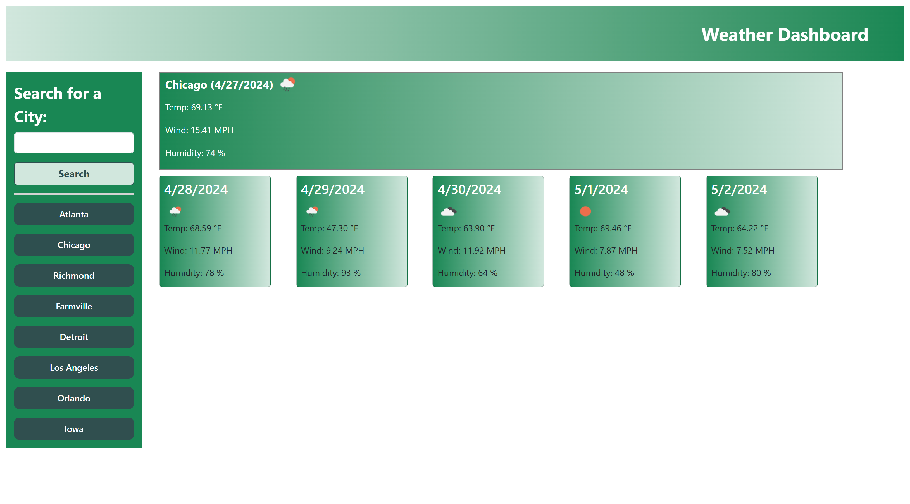

# weather_api_page

## Description

The focus of this challenge was on using an api via a fetch request. In this challenge we used the OpenWeather api to pull data from an external source and utilize it in on our webpage. In this challenge we made 2 primary fetch requests to the OpenWeather api. The first was to get the longitude and latitude of a city that was searched by our user, after optaining those coordinates we did another fetch request to get the weather forecast for that city, both the current and 5 day. We pulled multiple results from the data obtained by the fetch request, including the date, current temperature, wind conditions, humidity and an icon to summarize the weather conditions. In the challenge we also demonstrated the use of local storage to persist data, displaying previous searches on the page and enabling the user to click on them to re-search the weather data for that city. 

## Usage

Here is a [link to the webpage](https://rozierhj.github.io/weather_api_page/)

Webpage Design

